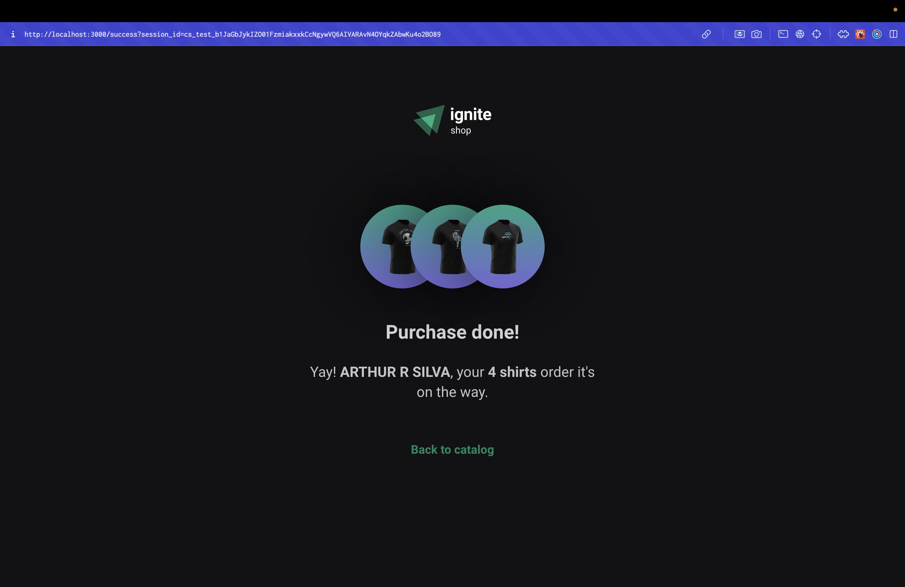

# Ignite Shop - Web

## The App
A e-Commerce type Web App made with Next.js that integrates the best practices of SSR and 3rd party API data fetching.

### Previews

  
  
  
  

### Techs
1. Next
2. Typescript
3. Tailwind CSS
4. Stripe
5. Axios
6. Zod

### Steps
1. Clone this repository;
2. Run your preferred command to install dependencies:
- `npm install`
- `yarn install` 
- `pnpm install` 
3. Fill `NEXT_PUBLIC_API_BASE_URL` and your Stripe keys in a `.env` file as the example inside `.env.example`;
5. Run the app with: 
- `npm run dev`
- `yarn dev` 
- `pnpm run dev` 